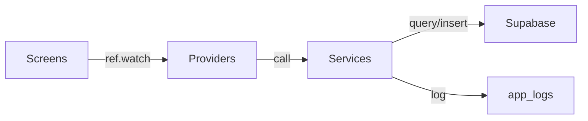
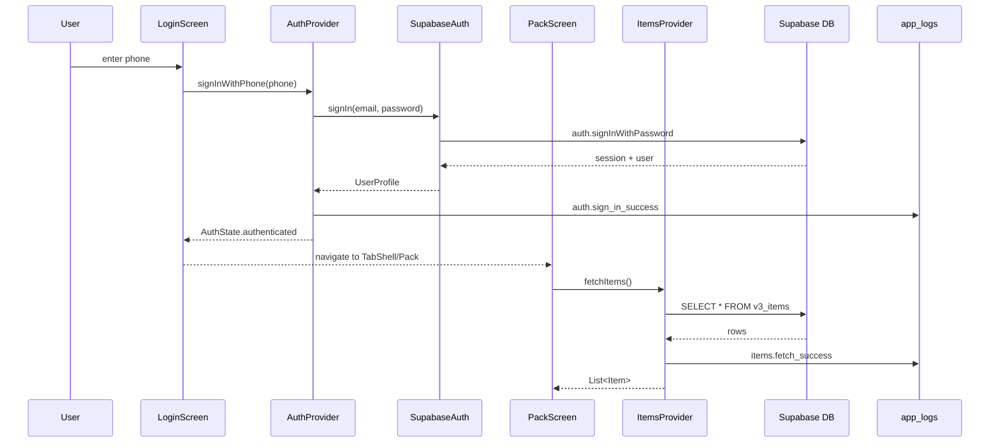
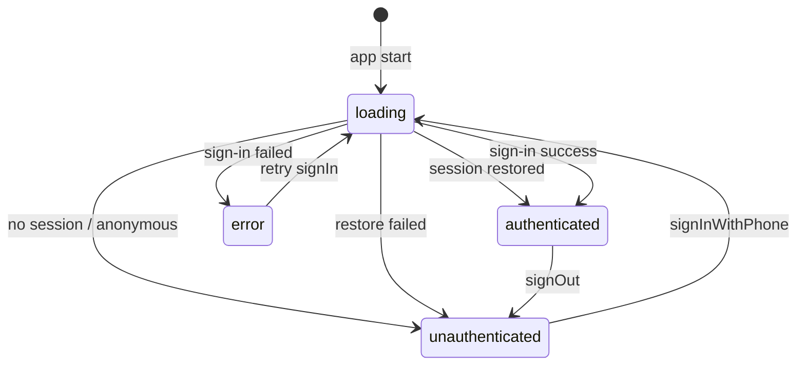

# EarthNova v3 Design Document

> The single source of truth for what we're building. Everything else points here.

---

## 1. Product Vision

EarthNova is a friendly, social geogame where the real world is the game board. Players explore real places via GPS, reveal a fog-of-war map, and discover 32,752 real species drawn from the IUCN Red List — each one a unique collectible with real taxonomy, rarity, and traits.

The game draws from a wide constellation of inspirations: the outdoor pull of Pokémon Go, the cozy satisfaction of Stardew Valley and Animal Crossing, the warmth of Cozy Grove and Spiritfarer, the strategic depth of Ark Nova, the citizen-science spirit of iNaturalist, and the trading and completion loops of card games. These point toward a rich future: trading species with other explorers, building and tending a sanctuary, completing collections, caretaking living animals, and sharing a world with other players. The tone is always friendly, cozy, and unhurried.

v3 restores a working foundation: login and your collection. Everything else is ahead.

---

## 2. MVP Scope

### What Ships

- **Login screen** — Phone number input (+1 prefix), derived email+password auth via Supabase. No OTP.
- **Pack screen** — Grid of user's existing items fetched from `v3_items`. Category filter chips. Sort by recent/rarity/name. Art display with fallback. Empty state.
- **Tab shell** — 4-tab bottom navigation. Pack is real. Map, Sanctuary, Settings are stubs.
- **Settings stub** — Sign out button only.
- **Observability** — Every auth and data state transition logged to Supabase `app_logs` from day 1.
- **Session persistence** — Close browser, reopen, still signed in.

### What Doesn't Ship (explicitly deferred)

| Feature | Why deferred |
|---------|-------------|
| Map, fog-of-war, GPS | Core gameplay — next after MVP is stable |
| Discovery / encounters | Requires map + cell system |
| Daily seed rotation | Requires discovery |
| Sanctuary, caretaking | Requires items + sanctuary UI |
| Trading, social, MMO | Requires multiplayer backend |
| Offline support, SQLite cache | Adds complexity (Drift, codegen, repos). Online-only for now. |
| Species seeding from bundled JSON | Already seeded in prod. Not needed client-side. |
| Enrichment pipeline | Already running server-side. Not touched by v3. |
| Achievements, streaks, badges | Post-MVP features |
| Collection completion / bundles | Post-MVP features |

### What "Done" Means

A real beta user can open the prod URL, enter their phone number, see their existing species collection, and sign out. A new user can create an account and see an empty pack. Every step is logged. All tests pass. CI is green.

---

## 3. Architecture

### Layer Diagram



No domain layer. No engine. No repositories. MVP is thin — screens read providers, providers call services, services talk to Supabase.

### Data Flow



### Auth State Machine



### File Structure

```
lib/
├── main.dart                         # Bootstrap, error boundary, observability init
├── models/                           # Immutable value objects
│   ├── auth_state.dart               # AuthStatus enum + AuthState class
│   ├── user_profile.dart             # UserProfile
│   ├── item.dart                     # Item (flat, what pack screen needs)
│   └── iucn_status.dart              # Rarity enum (for theme colors)
├── services/                         # Pure Dart, no Riverpod dependency
│   ├── auth_service.dart             # Abstract interface
│   ├── supabase_auth_service.dart    # Real Supabase impl
│   ├── mock_auth_service.dart        # In-memory impl for tests/offline
│   ├── supabase_bootstrap.dart       # Supabase init
│   ├── item_service.dart             # Fetches items from Supabase
│   └── observability_service.dart    # Batched event logging
├── providers/                        # Riverpod Notifiers
│   ├── auth_provider.dart            # AuthNotifier + authServiceProvider
│   └── items_provider.dart           # ItemsNotifier
├── screens/                          # Full-page widgets
│   ├── login_screen.dart
│   ├── loading_screen.dart
│   ├── pack_screen.dart
│   ├── map_stub_screen.dart
│   ├── sanctuary_stub_screen.dart
│   └── settings_screen.dart
├── widgets/                          # Reusable components
│   ├── tab_shell.dart
│   ├── item_card.dart
│   └── rarity_badge.dart
└── shared/                           # Constants, theme, tokens
    ├── app_theme.dart
    ├── design_tokens.dart
    ├── earth_nova_theme.dart
    └── constants.dart
```

### Code Rules

1. **Services are pure Dart.** No Riverpod `ref`, no Flutter imports. Testable with zero framework.
2. **Providers are thin.** They hold state and call services. No business logic in providers.
3. **Screens are `ConsumerWidget`.** They read providers via `ref.watch` and render. No direct service calls.
4. **One provider per concern.** `authProvider` owns auth state. `itemsProvider` owns items state. No god providers.
5. **No codegen.** Manual providers, manual models. No `build_runner`, no `*.g.dart`.
6. **No local storage.** Supabase is the only data store. No Drift, no SQLite, no SharedPreferences.

### Toolchain (everything as code)

Every tool, constraint, and operational procedure is a file in the repo. Nothing is tribal knowledge.

| Tool | File | What it codifies |
|------|------|-----------------|
| **mise** | `mise.toml` | Flutter 3.41.3, Supabase CLI, Terraform — pinned versions, reproducible toolchain |
| **Terraform** | `infra/` | Supabase project provisioning, infrastructure state |
| **Supabase CLI** | `supabase/migrations/` | Schema history, edge functions, seed data |
| **GitHub Actions** | `.github/workflows/` | CI (analyze + test), deploy (migrations + edge functions) |
| **Dockerfile** | `Dockerfile` | Build + deploy pipeline for Railway |
| **Mermaid** | In `docs/design.md` | Architecture diagrams, state machines, sequence diagrams — diffable, version-controlled |
| **Justfile** | `Justfile` | Task automation — single entry point for all commands (`just test`, `just deploy`, `just query "..."`) |
| **lefthook** | `.lefthook.yml` | Git hooks — `flutter analyze` + `flutter test` before every commit. No broken pushes. |
| **lcov** | CI + `flutter test --coverage` | Test coverage tracking with minimum threshold enforcement |
| **`.editorconfig`** | `.editorconfig` | Consistent formatting (indent size, line endings, trailing whitespace) across all editors and agents |
| **Dart doc comments** | `///` on public APIs | Generated API docs. Every service method, model, and provider gets a one-liner. |
| **JSON Schema** | `docs/schemas/` | Event payload shapes (`app_logs` events, write queue entries). Machine-validatable contracts. |
| **Docker Compose** | `docker-compose.yml` | Local Supabase + app — fully reproducible dev environment in one command |
| **Renovate** | `renovate.json` | Automated dependency update PRs. Dependency policy as code. |
| **analysis_options** | `analysis_options.yaml` | Lint rules, analyzer config |
| **pubspec** | `pubspec.yaml` | Dependencies with version constraints |

---

## 4. Auth Design

### Flow

1. User enters phone number (10 digits, +1 prefix hardcoded)
2. Client derives email: strip non-digits → `${digits}@earthnova.app`
3. Client derives password: `SHA-256("${phone}:earthnova-beta-2026")`
4. Try `signInWithPassword(email, password)`
5. If "invalid credentials" → `signUp(email, password, data: {phone_number: phone})`
6. On success → `AuthState.authenticated(UserProfile)`

### States

| State | When | UI |
|-------|------|----|
| `loading` | App starting, restoring session, sign-in in progress | LoadingScreen or spinner on button |
| `unauthenticated` | No session, or anonymous session detected | LoginScreen |
| `authenticated(UserProfile)` | Valid session with real user | TabShell |
| `error(String)` | Auth failed | LoginScreen with error message |

### Session Restore

On app start: check `currentSession` → if valid and not expired → `authenticated`. If expired → attempt `refreshSession`. If anonymous → sign out → `unauthenticated`. If no session → `unauthenticated`.

### Critical: Identity Bridge

`_deriveEmail` and `_derivePassword` are the identity bridge for beta users. These functions MUST be byte-for-byte identical to v2 (`lib/data/sync/supabase_auth.dart:145-153`). If they produce different output, existing users are locked out. A regression test with hardcoded known-good values is non-negotiable.

---

## 5. Data Model

### Supabase Tables (v3)

Four new tables created alongside existing ones. Old tables untouched — safety net until v3 is confirmed stable.

**`v3_profiles`**

| Column | Type | Notes |
|--------|------|-------|
| id | UUID PK | References `auth.users` |
| phone | TEXT | Raw phone number from sign-up |
| display_name | TEXT | Defaults to "Explorer" |
| created_at | TIMESTAMPTZ | |
| updated_at | TIMESTAMPTZ | |

**`v3_items`**

| Column | Type | Notes |
|--------|------|-------|
| id | UUID PK | |
| user_id | UUID FK | References `auth.users` |
| definition_id | TEXT | e.g. `fauna_vulpes_vulpes` |
| display_name | TEXT | e.g. "Red Fox" |
| scientific_name | TEXT? | e.g. "Vulpes vulpes" |
| category | TEXT | fauna, flora, mineral, fossil, artifact, food, orb |
| rarity | TEXT? | leastConcern, nearThreatened, vulnerable, endangered, criticallyEndangered, extinct |
| icon_url | TEXT? | Chibi icon frame 1 — default pose |
| icon_url_frame2 | TEXT? | Chibi icon frame 2 — shifted pose for 2Hz idle animation |
| art_url | TEXT? | Watercolor art from enrichment pipeline |
| acquired_at | TIMESTAMPTZ | |
| acquired_in_cell_id | TEXT? | Voronoi cell where discovered |
| status | TEXT | active, donated, placed, released, traded |
| created_at | TIMESTAMPTZ | |

**`v3_cell_visits`**

| Column | Type | Notes |
|--------|------|-------|
| id | UUID PK | |
| user_id | UUID FK | References `auth.users` |
| cell_id | TEXT | Voronoi cell ID |
| visited_at | TIMESTAMPTZ | Timestamp of this specific visit |

Every visit gets its own row. No UNIQUE constraint. Full visit history preserved.
- Fog-of-war: `EXISTS(user_id, cell_id)`
- Visit count: `COUNT(*) WHERE user_id = x AND cell_id = y`
- Streaks: group by `DATE(visited_at)`
- Future mechanics (restoration, achievements, social) all derivable from raw history.

**`v3_write_queue`**

| Column | Type | Notes |
|--------|------|-------|
| id | UUID PK | |
| user_id | UUID FK | References `auth.users` |
| action | TEXT | e.g. `visit_cell`, `collect_item` |
| payload | JSONB | Action-specific data |
| status | TEXT | pending, confirmed, rejected |
| created_at | TIMESTAMPTZ | |
| resolved_at | TIMESTAMPTZ? | |

Reserved for offline support. Empty in v3 MVP.

All tables have RLS: authenticated users read/write only their own rows. Auto-trigger creates `v3_profiles` row on new user signup.

### Dart Models

**`AuthState`** — named constructors, no subclasses
```dart
AuthState.loading()
AuthState.unauthenticated()
AuthState.authenticated(UserProfile user)
AuthState.error(String message)
// when() maps each status to a value
```

**`UserProfile`**
```dart
final String id;
final String phone;
final String? displayName;
final DateTime createdAt;
// fromJson(Map), copyWith, ==, hashCode
```

**`Item`**
```dart
final String id;
final String definitionId;
final String displayName;
final String? scientificName;
final ItemCategory category;
final String? rarity;
final String? iconUrl;         // frame 1 — default pose
final String? iconUrlFrame2;   // frame 2 — shifted pose (null until enriched)
final String? artUrl;
final DateTime acquiredAt;
final ItemStatus status;
// fromJson(Map), copyWith, ==, hashCode
```

**`ItemCategory`** enum: `fauna, flora, mineral, fossil, artifact, food, orb`

**`ItemStatus`** enum: `active, donated, placed, released, traded`

### What Lives Where

| Data | Location | Why |
|------|----------|-----|
| User session | Supabase auth | Source of truth |
| User profile | `v3_profiles` | Phone + display name |
| Collected items | `v3_items` | Denormalized — pack screen reads directly, no joins needed |
| Cell visits | `v3_cell_visits` | Full history — fog, counts, streaks all derivable |
| Offline writes | `v3_write_queue` | Reserved for offline support |
| Species catalog | `species` (existing) | 32,752 rows, already seeded. `icon_url_frame2` column added for 2-frame animation. |
| Event logs | `app_logs` (existing) | Reused from v2, structured columns |

---

## 6. Observability

### Why

The v2 outage ran undetected for weeks because there was no structured logging. In v3, observability is structural — not an add-on, not a nice-to-have. Every state transition emits an event. Every crash is caught. Every unexpected external event is recorded. If it's not in `app_logs`, it didn't happen.

### Destinations

| Data | Destination | Notes |
|------|-------------|-------|
| All structured events | Supabase `app_logs` | Primary. Queryable, persistent, RLS-protected. |
| All events in dev/mock mode | `debugPrint` only | No Supabase client — can't write. Never crashes. |
| Crashes | `app_logs` + `debugPrint` | Both. Console for local dev, Supabase for prod diagnosis. |
| Server output | Railway logs | Edge function logs, deploy output — server-side only. |
| Crashes (post-MVP) | Sentry | Symbolicated stack traces, grouping, alerts. Crash handler written to accept Sentry without restructuring. |

The `lines` column from v2 (batched raw `debugPrint` output) is not used in v3. `ObservabilityService` writes structured events only. Raw print output stays in the console.

### Table

Reuse existing `app_logs` (migration 024). Relevant columns:

| Column | Type | Notes |
|--------|------|-------|
| id | UUID PK | |
| user_id | UUID? | Null until auth completes. Set via `setUserId()`. |
| session_id | TEXT | UUID generated at app start. Constant for session lifetime. |
| category | TEXT | lifecycle, infrastructure, auth, data, network, error |
| event | TEXT | e.g. `auth.sign_in_success` |
| data | JSONB | Event-specific payload. Phone is always hashed, never raw. |
| platform | TEXT | web, ios, android |
| app_version | TEXT | From `APP_VERSION` dart-define |
| created_at | TIMESTAMPTZ | |

### Retention Policy

Managed by `pg_cron` job. Different categories have different lifetimes:

| Category | Retention |
|----------|-----------|
| error | 90 days |
| auth, lifecycle, infrastructure | 30 days |
| data, network | 14 days |
| performance (future) | 7 days |

### Event Catalog

**Lifecycle**

| Event | Data | Trigger |
|-------|------|---------|
| `app.cold_start` | `{version, platform, is_first_launch}` | App launched fresh |
| `app.warm_start` | `{}` | App resumed from background |
| `app.backgrounded` | `{}` | OS sends app to background. Also triggers `flush()`. |
| `app.foregrounded` | `{}` | App returns from background |
| `app.crash.flutter` | `{error, stack}` | `FlutterError.onError` — widget/framework crashes |
| `app.crash.unhandled` | `{error, stack}` | `runZonedGuarded` — unhandled async errors |

**Infrastructure**

| Event | Data | Trigger |
|-------|------|---------|
| `supabase.init_success` | `{}` | Supabase client initialized |
| `supabase.init_failure` | `{error}` | Backend unreachable at startup — user can't do anything |
| `supabase.auth_state_changed` | `{event}` | External auth event from Supabase stream |

**Network**

| Event | Data | Trigger |
|-------|------|---------|
| `network.offline` | `{}` | Connectivity lost |
| `network.online` | `{}` | Connectivity restored |

**Auth**

| Event | Data | Trigger |
|-------|------|---------|
| `auth.session_restore_started` | `{}` | App start, checking for existing session |
| `auth.session_restored` | `{}` | Valid session found — returning user |
| `auth.no_session` | `{}` | No stored session — new user or previously signed out |
| `auth.anonymous_signed_out` | `{}` | Anonymous session detected and cleared |
| `auth.session_expired` | `{}` | Token expired |
| `auth.session_refresh_success` | `{}` | Expired token refreshed successfully |
| `auth.sign_in_started` | `{phone_hash}` | User tapped Continue. Phone SHA-256 hashed. |
| `auth.sign_in_success` | `{}` | Signed in successfully |
| `auth.sign_in_error` | `{error_type, error_message, supabase_code, supabase_status, supabase_message}` | Sign-in failed — full raw detail |
| `auth.sign_up_started` | `{}` | No existing account — attempting sign-up |
| `auth.sign_up_success` | `{}` | New account created |
| `auth.session_refresh_failure` | `{error_type, error_message, supabase_code, supabase_status}` | Token refresh failed — full raw detail |
| `auth.external_sign_out` | `{}` | Session invalidated externally (another device, server) |
| `auth.sign_out` | `{}` | User-initiated sign-out |

**Data**

| Event | Data | Trigger |
|-------|------|---------|
| `items.fetch_started` | `{}` | Pack screen requests items |
| `items.fetch_success` | `{count}` | Items loaded |
| `items.fetch_error` | `{error_type, error_message, supabase_code, supabase_status}` | Fetch failed — full raw detail |
| `items.fetch_timeout` | `{elapsed_ms}` | Supabase slow but not erroring — hung UI |

### Client Architecture

#### `ObservabilityService`

Stateless service injected at app start. Never throws. Never crashes the app.

```dart
class ObservabilityService {
  final SupabaseClient? _client;  // null = debugPrint mode
  final String sessionId;         // UUID, constant per app launch
  String? _userId;                // set after auth completes
  final List<Map<String, dynamic>> _buffer = [];
  Timer? _flushTimer;

  /// Log a structured event. Call from ObservableNotifier.transition().
  void log(String event, String category, {Map<String, dynamic>? data});

  /// Log an error with full raw detail for diagnosis.
  /// Captures: exception type, message, full stack trace,
  /// and for Supabase errors: statusCode, error code, response body.
  /// This detail goes to app_logs only — never shown to the user.
  void logError(Object error, StackTrace stack, {String event = 'app.crash.unhandled'});

  /// Attach user ID to all subsequent events.
  void setUserId(String id);

  /// Flush buffer to Supabase. Fire-and-forget. Silent on failure.
  void flush();

  void dispose();
}
```

- Batches events, flushes every 5 seconds via `Timer.periodic`
- Also flushes on `app.backgrounded` (before OS may suspend the process)
- If `_client` is null, all events go to `debugPrint` only
- If `flush()` itself fails, logs to `debugPrint` — no retry, no crash
- Phone numbers are never stored raw — always SHA-256 hashed before logging
- All error events capture full raw detail in the `data` JSONB field:
  - `error_type` — exception class name
  - `error_message` — `error.toString()`
  - `stack_trace` — full stack trace string
  - `supabase_code` — Supabase error code if applicable (e.g. `invalid_credentials`)
  - `supabase_status` — HTTP status code if applicable (e.g. `400`, `503`)
  - `supabase_message` — raw Supabase error message
- Raw error detail goes to `app_logs` only — never surfaced to the user

#### `ObservableNotifier<T>`

Abstract base class. Every Notifier in the app extends this. Enforces observability structurally — compile error if `obs` getter not implemented, and `transition()` makes the event name required at every state change.

```dart
abstract class ObservableNotifier<T> extends Notifier<T> {
  /// Must be implemented by every subclass.
  /// Compile error if missing.
  ObservabilityService get obs;

  /// Use instead of raw `state = newState`.
  /// Logs the event and sets state atomically.
  @protected
  void transition(T newState, String event, {Map<String, dynamic>? data}) {
    obs.log(event, _category, data: data);
    state = newState;
  }

  /// Override to set the log category for this notifier.
  String get _category => 'state';
}
```

Usage:

```dart
class AuthNotifier extends ObservableNotifier<AuthState> {
  @override
  ObservabilityService get obs => ref.watch(observabilityProvider);

  @override
  String get _category => 'auth';

  Future<void> signInWithPhone(String phone) async {
    transition(const AuthState.loading(), 'auth.sign_in_started',
        data: {'phone_hash': _hashPhone(phone)});
    try {
      final user = await _authService.signInWithPhone(phone);
      transition(AuthState.authenticated(user), 'auth.sign_in_success');
    } catch (e) {
      transition(AuthState.error(e.toString()), 'auth.sign_in_error',
          data: {'error': e.toString()});
    }
  }
}
```

#### Error Serialization

Every error event captures two parallel representations:

```dart
// What the user sees (from error catalog):
"Couldn't sign in. Try again."

// What app_logs captures (full raw detail):
{
  "error_type": "AuthException",
  "error_message": "Invalid login credentials",
  "supabase_code": "invalid_credentials",
  "supabase_status": 400,
  "supabase_message": "Invalid login credentials",
  "stack_trace": "...",
}
```

The `logError()` method inspects the exception type. For `supabase_flutter` `AuthException` and `PostgrestException`, it extracts `statusCode`, `code`, and `message`. For all others, it falls back to `error.toString()` and the stack trace.

#### `main.dart` wiring

```dart
// 1. Catch Flutter framework errors (widget/build crashes)
FlutterError.onError = (details) {
  obs.logError(details.exception, details.stack ?? StackTrace.current,
      event: 'app.crash.flutter');
};

// 2. Catch all unhandled async errors
await runZonedGuarded(() async {

  // 3. Log cold start immediately — first event in every session
  obs.log('app.cold_start', 'lifecycle', data: {
    'version': const String.fromEnvironment('APP_VERSION', defaultValue: 'dev'),
    'platform': kIsWeb ? 'web' : Platform.operatingSystem,
  });

  // 4. Init Supabase — log success or failure
  try {
    await SupabaseBootstrap.initialize();
    obs.log('supabase.init_success', 'infrastructure');
  } catch (e, stack) {
    obs.logError(e, stack, event: 'supabase.init_failure');
    // App continues in mock/offline mode
  }

  // 5. Register lifecycle observer (background/foreground + flush)
  WidgetsBinding.instance.addObserver(AppLifecycleObserver(obs));

  // ... session restore, provider setup, runApp

}, (error, stack) {
  obs.logError(error, stack, event: 'app.crash.unhandled');
});
```

---

## 7. Error Handling

### Philosophy

Errors are split across two audiences:

- **Users** see plain language only — no exception messages, no stack traces, no Supabase error codes, no HTTP status codes. A message they can act on, and a way forward.
- **`app_logs`** captures full raw detail — exception type, message, stack trace, Supabase code, HTTP status. Everything needed to diagnose the failure. See §6 Error Serialization.

An error shown to a user with a raw stack trace is a failure of the error handling system. An error not captured in `app_logs` is a blind spot. Both are unacceptable.

### Error Catalog

| Code | User message | Cause | `app_logs` captures | Resolution |
|------|-------------|-------|---------------------|------------|
| `AUTH_INVALID_PHONE` | "Enter a valid 10-digit phone number" | Input < 10 digits or non-numeric | Validation only — no Supabase call | Inline error, no log needed |
| `AUTH_NETWORK` | "No connection. Check your network and try again." | Supabase unreachable | `error_type`, `error_message` | Show error, user retries |
| `AUTH_FAILED` | "Couldn't sign in. Try again." | Supabase auth rejected | Full: `supabase_code`, `supabase_status`, `supabase_message`, `stack_trace` | Show error, log `auth.sign_in_error` |
| `AUTH_SESSION_EXPIRED` | *(silent redirect)* | Token expired, refresh failed | Full error detail, log `auth.session_refresh_failure` | Redirect to login |
| `AUTH_EXTERNAL_SIGN_OUT` | *(silent redirect)* | Session invalidated externally | Log `auth.external_sign_out` | Redirect to login |
| `SUPABASE_INIT_FAILED` | "Couldn't connect. Some features may be unavailable." | Backend unreachable at startup | Full error detail, log `supabase.init_failure` | Show banner, continue in degraded mode |
| `ITEMS_FETCH_FAILED` | "Couldn't load your collection. Pull to retry." | Supabase query failed | Full: `supabase_code`, `supabase_status`, `supabase_message`, `stack_trace` | Error state with retry, log `items.fetch_error` |
| `ITEMS_EMPTY` | "No discoveries yet — explore to find species!" | User has 0 items | Not an error — no log | Empty state UI |
| `UNKNOWN` | "Something went wrong. Tap to retry." | Uncaught exception | Full: `error_type`, `error_message`, `stack_trace`, log `app.crash.*` | `ErrorBoundary` catches, shows recovery screen |

### `ErrorBoundary` Widget

Wraps the entire app below `ProviderScope`. Catches Flutter build errors that escape `FlutterError.onError`. Shows a recovery screen instead of a blank white page. Logs to `ObservabilityService` before rendering.

```
ProviderScope
  └── ErrorBoundary        ← catches widget tree errors, logs app.crash.flutter
      └── EarthNovaApp
          └── MaterialApp
              └── screens...
```

---

## 8. Performance Budgets

### Principle

Perceived responsiveness is the only metric that matters to the user. An app that responds instantly and loads in 2 seconds feels faster than one that takes 500ms to acknowledge a tap but loads in 1 second. Every user action must produce visible feedback within one frame (16ms).

**Animation is a performance tool, not decoration.** A moving element tells the user "I'm working" and makes a 2-second wait feel like 1. Every loading state must have motion. A static screen during a network call feels broken — an animated one feels alive.

### Loading Screen Pattern

After login succeeds, immediately navigate to `LoadingScreen`. Items are fetched behind it. When ready, transition to `TabShell`. This means:

- The user sees instant navigation feedback (< 16ms)
- The pack screen is never shown in an incomplete state
- Heavy async work (item fetch, profile load) happens behind a friendly animated screen

```
User taps Continue
  → AuthState.authenticated (immediate)
    → LoadingScreen shown (< 16ms — one frame)
      → items fetched in background
        → TabShell shown with pack already populated
```

### Animation Rules

Every loading state has motion. Every state transition is animated.

| State | Animation |
|-------|-----------|
| Loading screen | "Loading Pack..." with cycling ellipsis (`·`, `··`, `···`) on a 400ms loop — `AnimationController`. Costs nothing, removes all perception of hanging. |
| Login → LoadingScreen | Fade transition (200ms) |
| LoadingScreen → TabShell | Fade transition (300ms) |
| Pack items arriving | Staggered fade-in — cards appear sequentially, not all at once |
| Filter/sort switch | Items animate to new positions (implicit animations) |
| Error state appearing | Fade in (150ms) — abrupt error messages feel harsh |
| Button press | Ink ripple (Material default) — instant tactile feedback |

The animated ellipsis is the minimum viable animation: `"Loading Pack."` → `"Loading Pack.."` → `"Loading Pack..."`. If the user sees text changing, they know the app is alive.

### Budgets

| Metric | Budget | Priority |
|--------|--------|----------|
| Tap → visible response | < 16ms (1 frame) | Critical |
| Login screen first paint | < 1s | High |
| Session restored → pack visible | < 1s | High |
| Sign-in → LoadingScreen shown | < 16ms | High |
| LoadingScreen → pack visible | < 2s | Medium — animation covers the wait |
| Filter/sort switch | < 16ms | Medium |
| Supabase items fetch | < 1s p95 | Medium — hidden behind LoadingScreen |
| Supabase auth round-trip | < 2s p95 | Low |
| Flutter web bundle (gzipped) | < 5MB | Low |
| Scroll performance | 60 FPS | Medium |

Timing is measured via observability — timed transitions log elapsed milliseconds to `app_logs`. Budgets are monitored by querying `app_logs`, not enforced in CI for MVP.

---

## 9. Design System

Nothing is designed ad hoc. Every colour, spacing value, radius, shadow, and animation timing comes from the token system below. If a value isn't here, it doesn't exist yet — add it here first, then use it.

The v3 design system is ported directly from v1 (`lib/shared/` before commit `3569cc8`). It is proven, cohesive, and already covers the full game. Port it verbatim.

### Palette

| Role | Token | Hex | Use |
|------|-------|-----|-----|
| Primary | `AppTheme.primary` | `#006D77` | Deep teal — exploration, active states |
| Secondary | `AppTheme.secondary` | `#E29578` | Warm amber — discoveries, highlights |
| Tertiary | `AppTheme.tertiary` | `#83C5BE` | Soft green — sanctuary, success |
| Error | `AppTheme.error` | `#EF476F` | Coral red — errors, alerts |
| Surface | `_darkSurface` | `#0D1B2A` | Base navy — app background |
| Surface+1 | `_darkSurfaceContainer` | `#132333` | Cards, app bars |
| Surface+2 | `_darkSurfaceContainerHigh` | `#1A2D40` | Elevated cards |
| Surface+3 | `_darkSurfaceContainerHighest` | `#243A50` | Top-level overlays |
| On-surface | `_darkOnSurface` | `#E0E1DD` | Primary text |
| On-surface muted | `_darkOnSurfaceVariant` | `#ADB5BD` | Secondary text, icons |
| Outline | `_darkOutline` | `#3D5060` | Borders |
| Outline subtle | `_darkOutlineVariant` | `#253444` | Dividers |

Dark theme is primary. Light theme exists for accessibility but is not the design focus.

### Rarity Visual Language

| IUCN Status | Code | Colour | Hex | Text colour |
|-------------|------|--------|-----|-------------|
| Least Concern | LC | White | `#FFFFFF` | Dark `#1A1A2E` |
| Near Threatened | NT | Green | `#4CAF50` | White |
| Vulnerable | VU | Blue | `#2196F3` | White |
| Endangered | EN | Gold | `#FFD700` | Dark `#1A1A2E` |
| Critically Endangered | CR | Purple | `#9C27B0` | White |
| Extinct | EX | Amber | `#FFC107` | Dark `#1A1A2E` |

Rarity colour appears on: slot border, `RarityBadge` background, species card title bar tint, species card detail frame.

### Spacing (8px base grid)

```dart
abstract final class Spacing {
  static const double xxs = 2;   static const double xs  = 4;
  static const double sm  = 8;   static const double md  = 12;
  static const double lg  = 16;  static const double xl  = 20;
  static const double xxl = 24;  static const double xxxl = 32;
  static const double huge = 40; static const double massive = 48;
  static const double giant = 64;
}
```

### Border Radius

```dart
abstract final class Radii {
  static const double xs = 4;   static const double sm  = 6;
  static const double md = 8;   static const double lg  = 10;
  static const double xl = 12;  static const double xxl = 14;
  static const double xxxl = 16; static const double pill = 100;
}
```

### Animation Tokens

```dart
abstract final class Durations {
  static const Duration instant   = Duration(milliseconds: 100);  // icon state
  static const Duration quick     = Duration(milliseconds: 150);  // chip select
  static const Duration normal    = Duration(milliseconds: 250);  // page change
  static const Duration slow      = Duration(milliseconds: 350);  // slide-in
  static const Duration ellipsis   = Duration(milliseconds: 400);  // loading dots cycle
  static const Duration spriteFrame = Duration(milliseconds: 500); // 2-frame idle (2Hz)
  static const Duration prismatic  = Duration(milliseconds: 3500); // rainbow border
  static const Duration spriteIdle = Duration(milliseconds: 1800); // breathing fallback
}

abstract final class AppCurves {
  static const Curve standard = Curves.easeInOut;
  static const Curve slideIn  = Curves.easeOutCubic;
  static const Curve fadeIn   = Curves.easeOut;
  static const Curve bounce   = Curves.elasticOut;
}
```

### Component Inventory

Every reusable piece. Nothing gets built that isn't listed here first.

| Component | File | What it is |
|-----------|------|------------|
| `AppTheme` | `shared/app_theme.dart` | Material theme factories (dark/light) |
| `EarthNovaTheme` | `shared/earth_nova_theme.dart` | ThemeExtension — rarity colors, frosted glass, shadows |
| `DesignTokens` | `shared/design_tokens.dart` | Spacing, Radii, Shadows, Durations, AppCurves, Blurs, Opacities, ComponentSizes |
| `ItemSlotWidget` | `widgets/item_slot_widget.dart` | PC-box grid cell — habitat gradient bg, icon, rarity badge, name |
| `RarityBadge` | `widgets/rarity_badge.dart` | Coloured IUCN code badge (LC/NT/VU/EN/CR/EX). Two sizes: small (grid), medium (card) |
| `SpeciesCard` | `widgets/species_card.dart` | TCG-style detail card — title bar → art → type bar → info → footer |
| `HabitatGradient` | `widgets/habitat_gradient.dart` | Habitat-tinted gradient BoxDecoration for slot/card backgrounds |
| `PrismaticBorder` | `widgets/prismatic_border.dart` | Animated rainbow border for first-discovery items |
| `PrismaticAnimationScope` | `widgets/prismatic_border.dart` | Shared AnimationController for prismatic border — one per grid |
| `SpriteAnimationScope` | `widgets/sprite_animation_scope.dart` | Shared AnimationController for 2-frame idle at 2Hz — one per grid. Each slot reads `controller.value + phaseOffset` to determine current frame. |
| `SpeciesArtImage` | `widgets/species_art_image.dart` | Network image with emoji fallback, breathing animation, shimmer loading |
| `EmptyStateWidget` | `widgets/empty_state_widget.dart` | Consistent empty state — icon + title + subtitle |
| `LoadingDots` | `widgets/loading_dots.dart` | Animated ellipsis (`·` `··` `···`) on 400ms loop |
| `ErrorStateWidget` | `widgets/error_state_widget.dart` | Error message + retry button |
| `IdenticonAvatar` | `widgets/identicon_avatar.dart` | Deterministic avatar generated from user ID seed |
| `_PageDotIndicator` | `screens/pack_screen.dart` (private) | 7-dot page indicator for the Pack screen category PageView — active dot expands to a teal pill |

---

## 10. Screen Designs

All screens use `AppTheme.dark()`. Every screen is fully specified before it is coded.

### Loading Screen

The first thing a user sees after every launch. Must feel alive.

```
┌─────────────────────────────────┐
│                                 │
│                                 │
│          EarthNova              │  ← wordmark, 28px, w700, onSurface
│                                 │
│       Loading Pack·             │  ← 15px, onSurfaceVariant
│                                 │  ← ellipsis cycles: · ·· ··· on 400ms loop
│                                 │
└─────────────────────────────────┘
```

- Background: `#0D1B2A` (surface)
- "EarthNova" centred, `fontSize: 28`, `fontWeight: w700`, `color: onSurface`
- "Loading Pack" + animated `LoadingDots`, `fontSize: 15`, `color: onSurfaceVariant`
- Vertical spacing: `EarthNova` at 38% height, `Loading Pack` 12px below
- Enter: fade in over 200ms from login/splash
- Exit: fade out over 300ms to TabShell

### Login Screen

```
┌─────────────────────────────────┐
│                                 │
│                                 │
│          EarthNova              │  ← 32px, w700, #E0E1DD, letterSpacing -0.5
│    Explore. Discover. Reveal.   │  ← 14px, #ADB5BD
│                                 │
│           ← 40px gap →          │
│                                 │
│  ┌────────────────────────────┐ │
│  │ +1  │ (555) 123-4567      │ │  ← fill #132333, radius 12px
│  └────────────────────────────┘ │
│                                 │
│           ← 16px gap →          │
│                                 │
│  ┌────────────────────────────┐ │
│  │         Continue           │ │  ← fill #006D77, radius 12px, 52px tall
│  └────────────────────────────┘ │
│                                 │
│  "Couldn't sign in. Try again." │  ← errorText below field, #EF476F, 12px
│                                 │
└─────────────────────────────────┘
```

#### Layout

| Property | Value |
|----------|-------|
| Scaffold background | `AppTheme.surface` `#0D1B2A` |
| Body structure | `SafeArea` → `Center` → `SingleChildScrollView` → `Column` |
| Horizontal padding | `Spacing.lg` 16px (both sides, on `SingleChildScrollView`) |
| Column alignment | `mainAxisAlignment: center`, `crossAxisAlignment: center` (default) |

`Center` vertically centres the scroll view when content is shorter than the viewport.
`TextField` fills the available column width automatically.
The `ElevatedButton` is wrapped in `SizedBox(width: double.infinity)` to explicitly
fill the width (the theme's `minimumSize: Size(double.infinity, 52)` achieves the same
result, but the SizedBox wrapper makes the intent explicit at the call site).

#### Brand block

| Element | Value |
|---------|-------|
| Wordmark | `"EarthNova"`, `fontSize: 32`, `fontWeight: w700`, `color: #E0E1DD`, `letterSpacing: -0.5` |
| Tagline | `'Explore. Discover. Reveal.'`, `fontSize: 14`, `color: #ADB5BD` |
| Wordmark → tagline gap | `Spacing.xs` 4px |
| Tagline → phone field gap | `Spacing.huge` 40px |

#### Phone input field

| Property | Value |
|----------|-------|
| Widget | `TextField` with `InputDecoration` |
| Fill colour | `AppTheme.surfaceContainer` `#132333` (via theme `fillColor`) |
| Border radius | `Radii.xl` 12px on all border states |
| Content padding | `horizontal: 16px, vertical: 14px` (via theme `contentPadding`) |
| Prefix text | `'+1 '` (trailing space for visual gap from user digits) |
| Prefix style | `fontSize: 16`, `color: #ADB5BD` (onSurfaceVariant) |
| Placeholder (`hintText`) | `'(555) 123-4567'` |
| Hint style | `fontSize: 16`, `color: #ADB5BD` — same size as entered text, muted colour |
| Entered text style | `fontSize: 16`, `color: #E0E1DD` |
| Keyboard type | `TextInputType.phone` |
| Input formatter | `_PhoneInputFormatter` (see below) |
| Max raw digits | 10 — enforced by `_PhoneInputFormatter`, not by `maxLength` |
| Counter | Hidden via `counterText: ''` |
| Validation gate | `rawDigits.length >= 10` where `rawDigits = text.replaceAll(RegExp(r'[^\d]'), '')` |

**Input field border states** — all defined in `AppTheme.dark()` `InputDecorationTheme`:

| State | Border |
|-------|--------|
| Empty, unfocused | `BorderSide.none` — no ring, card-like appearance |
| Typing / filled, unfocused | `BorderSide.none` |
| Focused (any content) | 2px solid `#006D77` (primary) |
| Error, unfocused | 1.5px solid `#EF476F` (error) |
| Error + focused | 2px solid `#EF476F` (error) |
| Disabled (loading) | `BorderSide.none`; fill darkened by M3 disabled overlay |

**Input field fill/text states:**

| State | Fill | Text / hint |
|-------|------|-------------|
| Enabled, empty | `#132333` | hint `#ADB5BD` at full opacity |
| Enabled, typing | `#132333` | entered text `#E0E1DD` |
| Disabled (`enabled: false`) | M3 applies `onSurface × 0.12` over fill | text `onSurface × 0.38` |

#### `_PhoneInputFormatter`

Private `TextInputFormatter` in `login_screen.dart`. Applied via
`inputFormatters: [_PhoneInputFormatter()]` on the `TextField`.

**Purpose:** ensures the live input text always matches the `(NNN) NNN-NNNN` placeholder
format, so there is zero visual mismatch between the hint and what the user types.

**Algorithm:**
1. Strip all non-digit characters from `newValue.text`
2. Cap at 10 raw digits (paste protection)
3. Re-build the formatted string character by character:
   - Insert `(` before digit 0
   - Insert `) ` after digit 2 (before digit 3)
   - Insert `-` after digit 5 (before digit 6)
4. Return a `TextEditingValue` with cursor collapsed to end

**Format progression:**

| Raw digits typed | Formatted display |
|-----------------|-------------------|
| `5` | `(5` |
| `55` | `(55` |
| `555` | `(555` |
| `5551` | `(555) 1` |
| `55512` | `(555) 12` |
| `555123` | `(555) 123` |
| `5551234` | `(555) 123-4` |
| `55512345` | `(555) 123-45` |
| `555123456` | `(555) 123-456` |
| `5551234567` | `(555) 123-4567` ← matches placeholder exactly |

**Backspace behaviour:** each backspace recalculates from the stripped digit string, so
punctuation characters (`(`, `)`, ` `, `-`) are never individually deletable — they
vanish automatically when the surrounding digit is removed.

**Cursor:** always placed at the end of the formatted string after any edit.

#### Continue button

| Property | Value |
|----------|-------|
| Widget | `ElevatedButton` inside `SizedBox(width: double.infinity)` |
| Background (enabled) | `AppTheme.primary` `#006D77` |
| Foreground (text / icon) | `Colors.white` `#FFFFFF` |
| Height | `ComponentSizes.buttonHeight` 52px (via theme `minimumSize`) |
| Border radius | `Radii.xl` 12px (via theme `shape`) |
| Label | `'Continue'`, `fontSize: 16`, `fontWeight: w600` |
| Gap above (from input) | `Spacing.lg` 16px |

**Button states:**

| State | Condition | Background | Label / content |
|-------|-----------|------------|-----------------|
| Enabled | `_isValid && !isLoading` | `#006D77` | `'Continue'` white |
| Disabled | `!_isValid \|\| isLoading` (`onPressed: null`) | `onSurface × 0.12` ≈ `#E0E1DD` at 12 % | `'Continue'` at `onSurface × 0.38` |
| Loading | `isLoading == true` | `#006D77` | `CircularProgressIndicator` 20 × 20, `strokeWidth: 2`, white |
| Pressed | tap | `#006D77` with Material ink ripple | `'Continue'` white |

The disabled colours are Material 3 defaults — no custom override needed.

#### Error state

- **Rendered via:** `InputDecoration.errorText` — appears below the phone field, above the button gap
- **Colour:** `colorScheme.error` → `AppTheme.error` `#EF476F` (Material 3 default for `errorText`)
- **Font size:** 12px (Material 3 default for error label)
- **Border:** field simultaneously switches to `errorBorder` — 1.5px `#EF476F` ring
- **Trigger:** `AuthStatus.error` → `setState(() => _errorText = authState.errorMessage)`
- **Dismissal:** first keystroke after an error clears `_errorText` (set to `null` in `_onPhoneChanged`)

#### Disabled / enabled transition logic

```dart
// Button enabled only when the number is valid AND no request is in flight.
onPressed: _isValid && !isLoading ? _onContinue : null

// Field disabled while loading to prevent concurrent submissions.
enabled: !isLoading
```

#### Auth flow (from this screen)

1. User taps **Continue** → `_onContinue()` called
2. Strips formatting: `digits = text.replaceAll(RegExp(r'[^\d]'), '')` (always 10 chars)
3. Calls `authProvider.notifier.signInWithPhone('+1$digits')`
4. On `AuthStatus.error` response: sets `_errorText` for inline display
5. On `AuthStatus.authenticated`: router navigates to `LoadingScreen` automatically
6. Phone stored as `+1XXXXXXXXXX` (E.164-adjacent) — no OTP (see Key Decisions)

### Pack Screen

The centrepiece. Pokémon PC Box meets TCG binder.

**Structure (v3 MVP):**
```
AppBar: "Pack · {filtered count}"
FilterBar: 🦊 Fauna · 4 | 🌿 Flora | 💎 Mineral | 🦴 Fossil | 🏺 Artifact | 🍎 Food | 🔮 Orb
────────────────────────────────────────────────────────────────────────────────────────────
SortBar (when items > 0):                             [ Recent ] [ Rarity ] [ Name ]
PageDotIndicator: • ─ • • • • •  (7 dots; active = teal pill, inactive = muted circle)
────────────────────────────────────────────────────────────────────────────────────────────
PageView — one page per category (swipe left/right to change category)
  └─ Grid (responsive columns — see breakpoints below)
```

**Swipe Interaction:**
- The item grid is a `PageView.builder` with 7 pages, one per `ItemCategory`.
- Swipe left → next category; swipe right → previous category.
- Page change triggers `HapticFeedback.selectionClick()` for tactile confirmation.
- Tapping a filter chip animates the PageView to the corresponding page via
  `PageController.animateToPage(duration: 250ms, curve: easeInOut)`.
- When a swipe advances to an off-screen chip, the filter `ListView` scrolls
  proportionally so the active chip stays visible.
- Each page filters and sorts independently; the empty-state per category shows
  that category's emoji + "No {cat} in your pack yet. Keep exploring!"

**Responsive Grid Breakpoints:**

| Viewport width | Columns | `childAspectRatio` | Card size (375px phone) |
|----------------|---------|---------------------|------------------------|
| `< 600px`      | 3       | 0.78                | ~114 × 146 px          |
| `600–899px`    | 4       | 0.82                | ~145 × 177 px          |
| `≥ 900px`      | 6       | 0.85                | ~148 × 174 px          |

Grid padding: `Spacing.sm` (8px) all sides. Gap: `Spacing.sm` (8px) both axes.

**FilterBar anatomy:**
- Container: `height: 52px`, `color: surfaceContainer`, bottom border `outline 0.5px`
- Horizontally scrolling `ListView.separated`, padding `horizontal: 8px, vertical: 4px`
- Each chip: `_CategoryChip` — pill shape (`Radii.pill`), `horizontal: 12px / vertical: 2px` padding
- Selected chip: `primary` fill + border, white text, `w600`
- Unselected chip: `surfaceContainerHigh` fill, `outline` border, `onSurfaceVariant` text, `w400`
- Count badge (inside chip, shown when `count > 0`): 10px `w700` text in translucent pill
  - Selected: `white × 0.25` background, white text
  - Unselected: `outline × 0.6` background, `onSurfaceVariant` text
- Chip label font: 13px, emoji 14px, `Spacing.xs` gap
  - **No `height: 1`** — the EM-square clamp clips emoji glyphs on some platforms.
    Default line-height renders cleanly without truncation.

**SortBar anatomy:**
- Container: bottom border `outline 0.5px`, padding `horizontal: 12px, vertical: 4px`
- Three pill toggle buttons right-aligned: `Recent`, `Rarity`, `Name`
- Selected pill: `primary × 0.15` fill, `primary × 0.6` border, `primary` text `w600`
- Unselected pill: transparent, no border, `onSurfaceVariant` text `w400`
- Pill padding: `horizontal: 8px, vertical: 4px`; font: 12px

**ItemSlot anatomy (v3 MVP):**

```
┌────────────────────────────┐
│                      [CR]  │  ← RarityBadge — purple pill, top-right, 4px inset
│                            │
│            🦊              │  ← species icon (iconUrl → category emoji fallback)
│          44 × 44           │     centred, top padding 12px
│                            │
│ ● (teal dot, if frame2)   │  ← animated-species indicator, bottom-left 4px inset
├────────────────────────────┤
│    Amur Leopard            │  ← surfaceContainer × 0.85 strip
│                            │     10px w600, 2 lines, center, ellipsis
└────────────────────────────┘
```

- Background: `surfaceContainerHigh`
- Border: rarity colour at rarity-scaled opacity (see table below), `1.5px`, `Radii.xl` (12px)
- `clipBehavior: Clip.antiAlias` — clips the name-strip background and any
  overflowing paint to the card's rounded corners, preventing text/content
  from visually spilling outside the card boundary.
- Glow: `boxShadow` with rarity colour for EN and higher
- Name strip: `surfaceContainer × 0.85`, `BorderRadius.vertical(bottom: Radii.lg)` (10px)
  - `maxLines: 2`, `overflow: TextOverflow.ellipsis` — long names truncate cleanly.
- Tap: TODO — opens `SpeciesCard` bottom sheet

**Rarity border intensity:**

| IUCN Status        | Code | Border alpha | Glow alpha | Glow blur |
|--------------------|------|-------------|------------|-----------|
| Critically Endangered | CR | 0.90        | 0.35       | 12px      |
| Endangered         | EN   | 0.85        | 0.25       | 12px      |
| Vulnerable         | VU   | 0.65        | 0.15       | 12px      |
| Near Threatened    | NT   | 0.50        | —          | —         |
| Least Concern      | LC   | 0.12        | —          | —         |
| Unknown            | —    | 0.50 (outline) | —       | —         |

**RarityBadge anatomy:**
- Pill shape: `Radii.xs` (4px), padding `horizontal: 4px, vertical: 1px`
- Font: 8px, `w800`, `letterSpacing: 0.4`, `height: 1.2`
- Glow: `boxShadow` with badge colour at 0.5 alpha, `blurRadius: 4`

| Code | Background | Text |
|------|-----------|------|
| CR   | `#9C27B0` | white |
| EN   | `#FFD700` | `#1A1A2E` |
| VU   | `#2196F3` | white |
| NT   | `#4CAF50` | white |
| LC   | `#FFFFFF` | `#1A1A2E` |

**Animated-species indicator:**
- 5×5px circle, `AppTheme.tertiary × 0.9`, bottom-left at `Spacing.xs` inset
- Soft teal glow: `boxShadow` with `tertiary × 0.5`, `blurRadius: 4`
- Visible only when `iconUrlFrame2 != null` (species has 2-frame animation data)

**Species icon:**
- `Image.network(iconUrl, width: 44, height: 44, fit: BoxFit.contain)` with emoji fallback
- Fallback: `Text(category.emoji, fontSize: 36)` when `iconUrl` is null or fails to load

**2-Frame Idle Animation (living pack)**

Every slot animates at 2Hz — alternating between two real art frames to make the pack feel alive, like Pokémon PC Box sprites. Performed by a single shared `AnimationController` (`SpriteAnimationScope`) wrapping the entire grid — one controller per grid, not one per slot.

```
Frame A: icon_url       (default pose)
Frame B: icon_url_frame2 (shifted pose — generated by enrichment pipeline)
Cycle: 500ms per frame (2Hz)
Phase offset: definitionId.hashCode % 500ms — species never all jump in sync
```

Implementation:
- `SpriteAnimationScope` — shared `AnimationController`, `duration: 500ms`, `repeat()`
- Each `ItemSlotWidget` reads `controller.value + phaseOffset`, determines frame from `value > 0.5`
- Frame switch is discrete (`AnimatedSwitcher` with zero duration, or direct `Image` swap) — snappy, not floaty
- `SpriteAnimationScope` works alongside `PrismaticAnimationScope` — both live on the grid
- Fallback when `icon_url_frame2` is null (not yet enriched): static `icon_url`, no animation until frame 2 arrives

**Schema:** `icon_url_frame2 TEXT` in both `species` and `v3_items`. Added in migration 032 and the species enrichment pipeline. Enrichment generates both frames together — frame 1 (neutral pose) + frame 2 (shifted pose, ~2px up, subtle expression change). When the enrichment pipeline populates `icon_url_frame2`, the slot immediately starts animating on next fetch — no client change needed.

**Tapping a slot — SpeciesCard modal (bottom sheet):**
```
┌──────────────────────────────────────┐
│  Red Fox               [LC] [★]      │  ← title bar, habitat-tinted bg
├──────────────────────────────────────┤
│                                      │
│            [watercolor art]          │  ← 2:3 art zone
│                                      │
├──────────────────────────────────────┤
│  🦁 Mammal › Carnivore               │  ← type bar
├──────────────────────────────────────┤
│  Brawn ████████░░  72                │
│  Speed ██████░░░░  60                │
│  Wit   ███░░░░░░░  24 (= 90 total)  │  ← stat bars, RGB color identity
├──────────────────────────────────────┤
│  📍 Halifax, NS 🇨🇦   Jan 3, 2026    │  ← location + date footer
└──────────────────────────────────────┘
```

**All other category tabs (v3):** Empty state (`EmptyStateWidget`) with category icon + "Coming soon". Not "stubs" — proper empty states using the design system.

**Character tab:** Player avatar (identicon, 96px circle gradient), adventure stats (streak, distance, cells), per-category inventory counts.

**Sort options:**
- Recent (default) — `acquired_at DESC`
- Rarity — EX → CR → EN → VU → NT → LC
- Name — alphabetical A→Z
- Type — by `AnimalType` (Mammal → Bird → Fish → Reptile → Bug)

**Empty state (no fauna at all):**
```
        🦊
  No fauna collected yet
  Explore the world to find wildlife!
```
Uses `EmptyStateWidget`. Icon 52px, title `onSurface`, subtitle `onSurfaceVariant`.

### Settings Screen

Minimal. Only sign-out in v3.

```
AppBar: "Settings"
────────────────────────────────
[identicon avatar, 96px, centred]
  display_name or phone number
  "Explorer"  (role label)

────────────────────────────────

[ Sign Out ]  ← OutlinedButton, error color, full width
```

- Tap Sign Out: confirmation dialog (`AlertDialog`) — "Sign out?" + Cancel/Sign Out
- Sign Out button: `error` colour, outlined (not filled — destructive action, lower visual weight)

### Stub Screens (Flora, Mineral, Fossil, Artifact, Food, Orb)

Not blank — proper empty states with game-consistent design.

```
        [category icon, 52px]
  [Category name] — Coming soon
  More discoveries on the way!
```

Uses `EmptyStateWidget`. Background `surface`. Centred vertically.

### Navigation (Tab Shell)

Bottom navigation bar, 4 tabs. `NavigationBar` (Material 3).

| Index | Icon | Label | Screen |
|-------|------|-------|--------|
| 0 | 🗺️ | Map | `MapStubScreen` |
| 1 | 🎒 | Pack | `PackScreen` |
| 2 | 🌿 | Sanctuary | `SanctuaryStubScreen` |
| 3 | ⚙️ | Settings | `SettingsScreen` |

- Default tab on login: Pack (index 1)
- `IndexedStack` preserves tab state — acceptable for MVP (stub screens are trivial)

---

## 11. Acceptance Criteria

These criteria map 1:1 to test cases. A feature is not done until every criterion in its group passes — in tests and on prod.

### Auth

- [ ] New user: enter 10-digit phone → account created → `LoadingScreen` → Pack tab
- [ ] Returning beta user: enter phone → signed in → `LoadingScreen` → pack shows existing items
- [ ] Session persist: close browser → reopen → skip login → `LoadingScreen` → Pack
- [ ] Expired session: reopen after token expiry → refresh succeeds → Pack
- [ ] Expired session, refresh fails: → `LoginScreen`
- [ ] Anonymous session on restore: detected → signed out → `LoginScreen`
- [ ] External sign-out (token invalidated server-side): → `LoginScreen`
- [ ] Phone < 10 digits: Continue button disabled, no submission
- [ ] Phone exactly 10 digits: Continue button enabled
- [ ] Phone > 10 digits: not accepted (input masks to 10)
- [ ] Network error during sign-in: "No connection. Check your network and try again." shown, no crash
- [ ] Auth failure (wrong credentials): "Couldn't sign in. Try again." shown, no crash
- [ ] Sign in → `app_logs` has `auth.sign_in_started` (phone hashed) + `auth.sign_in_success`
- [ ] Sign in error → `app_logs` has `auth.sign_in_error` with full `supabase_code`, `supabase_status`, `error_message`, `stack_trace`
- [ ] `_deriveEmail('+15551234567')` == `'15551234567@earthnova.app'` ← regression, must never change
- [ ] `_derivePassword('+15551234567')` == known hardcoded SHA-256 hash ← regression, must never change

### Loading Screen

- [ ] `LoadingDots` cycles `·` `··` `···` at 400ms — never static
- [ ] Login → `LoadingScreen`: fade transition ~200ms
- [ ] `LoadingScreen` → `TabShell`: fade transition ~300ms
- [ ] `LoadingScreen` never visible > 5s — timeout renders error state with retry

### Pack Screen

**Responsiveness**
- [ ] Grid: 3 columns when viewport `< 600px`, 4 columns at `600–899px`, 6 columns at `≥ 900px`
- [ ] `childAspectRatio` 0.78 / 0.82 / 0.85 respectively — cards remain readable at all breakpoints

**FilterBar**
- [ ] FilterBar always visible (loading and empty states show spinner/empty below it)
- [ ] Seven category chips: Fauna, Flora, Mineral, Fossil, Artifact, Food, Orb
- [ ] Selected chip: `primary` fill, white label `w600`, count badge in `white × 0.25`
- [ ] Unselected chip: `surfaceContainerHigh` fill, `outline` border, `onSurfaceVariant` label
- [ ] Count badge only shown when `count > 0`
- [ ] FilterBar scrolls horizontally on narrow viewports — no overflow

**SortBar**
- [ ] SortBar hidden when filtered list is empty; visible when ≥ 1 item
- [ ] Three pill buttons: Recent (default), Rarity, Name — right-aligned
- [ ] Active pill: `primary × 0.15` fill, `primary × 0.6` border, `primary` text
- [ ] Tapping pill re-sorts grid immediately (< 16ms)

**ItemSlot**
- [ ] Background: `surfaceContainerHigh`; border: rarity colour at rarity-scaled opacity, `1.5px`, `Radii.xl`
- [ ] CR and EN slots have ambient glow (`boxShadow` with rarity colour)
- [ ] `RarityBadge` top-right: colour-coded pill (CR purple / EN gold / VU blue / NT green / LC white)
- [ ] Icon: `Image.network(iconUrl)` 44×44px, fit contain; falls back to `category.emoji` at 36px on error/null
- [ ] Name strip: `surfaceContainer × 0.85`, bottom-rounded, 10px `w600`, 2-line ellipsis
- [ ] Animated-species dot (5px teal circle) shown only when `iconUrlFrame2 != null`
- [ ] Slot with `icon_url_frame2` null: static icon, no dot indicator
- [ ] Minimum touch target: card is ≥ 90px tall at 3-column layout on 375px screen

**States**
- [ ] Loading: `Center(LoadingDots)`, title shows plain `'Pack'`
- [ ] Error: warning icon, message, `'Try Again'` `FilledButton` — no filter/sort chrome
- [ ] Global empty (0 items): filter bar + `_EmptyState` with active category emoji + "Explore" subtitle
- [ ] Category empty (items exist elsewhere): filter bar shows counts + `_EmptyState` with category emoji + "Keep exploring" subtitle
- [ ] Title: `'Pack · N'` where N = filtered count (not total); plain `'Pack'` when total = 0

**Sort behaviour**
- [ ] Sort Recent: items ordered `acquired_at DESC`
- [ ] Sort Rarity: CR → EN → VU → NT → LC
- [ ] Sort Name: A→Z alphabetical

**Post-MVP (not in v3)**
- [ ] `SpriteAnimationScope` 2-frame idle at 2Hz (staggered phase offsets)
- [ ] `PrismaticBorder` animated rainbow for first-discovery slots
- [ ] `HabitatGradient` tinted backgrounds
- [ ] `SpeciesCard` bottom sheet on slot tap
- [ ] Animal type subtabs (Mammal / Bird / Fish / Reptile / Bug)
- [ ] Sort by Type

**Observability**
- [ ] `items.fetch_success` logged with correct `count`
- [ ] `items.fetch_error` logged with full error detail — no crash, retry shown

### Settings Screen

- [ ] AppBar title: "Settings"
- [ ] Identicon avatar (96px, circle) centred
- [ ] Display name or phone shown below avatar
- [ ] Sign Out button: outlined, error colour, full width
- [ ] Tap Sign Out → `AlertDialog` with "Cancel" and "Sign Out"
- [ ] Confirm Sign Out → `authProvider.signOut()` → `LoginScreen`
- [ ] Cancel → dialog dismisses, stays on Settings
- [ ] `auth.sign_out` logged

### Stub Screens (Map, Sanctuary)

- [ ] Map tab: `EmptyStateWidget` — icon, "Coming soon", subtitle
- [ ] Sanctuary tab: `EmptyStateWidget` — icon, "Coming soon", subtitle
- [ ] Both use design system (`EmptyStateWidget`, `surface` background) — not blank

### Observability

- [ ] `app.cold_start` logged on every fresh launch with `version` + `platform`
- [ ] `supabase.init_success` or `supabase.init_failure` logged on every launch
- [ ] `auth.session_restore_started` logged on every launch
- [ ] All auth events logged with correct `category: 'auth'`
- [ ] All error events include: `error_type`, `error_message`, `stack_trace`, Supabase fields where applicable
- [ ] Phone never appears raw in any `app_logs` row
- [ ] `app.backgrounded` flushes the observability buffer
- [ ] `ObservableNotifier` subclass without `obs` getter → compile error

### Infrastructure

- [ ] `flutter analyze` → 0 errors, 0 warnings
- [ ] `flutter test` → all tests pass (no skips)
- [ ] `flutter build web` → succeeds, bundle < 5MB gzipped
- [ ] Railway deploy → prod URL loads `LoginScreen` within 10s
- [ ] `v3_profiles`, `v3_items`, `v3_cell_visits`, `v3_write_queue` exist in prod with correct columns
- [ ] `v3_items` has `icon_url_frame2` column
- [ ] Old tables (`profiles`, `item_instances`, `cell_progress`) exist and have same row counts as before migration
- [ ] New beta user: sign up → row created in both `profiles` AND `v3_profiles`
- [ ] RLS: user A cannot read user B's `v3_items`
