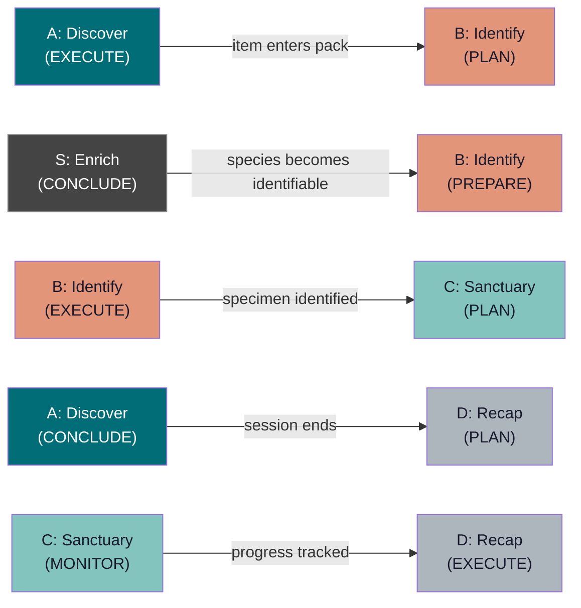

<!-- status: review -->
<!-- needs_human_review: true -->
<!-- last_updated: 2026-04-05 -->

# EarthNova — JTBD Job Maps (Problem Space)

> Modeled using the JTBD Canvas (Kalbach & Matthias, V3).
> Each canvas is a `.mmd` file representing one user story as a job-to-be-done.
> These define WHAT the player is trying to accomplish. Architecture flows from here.

---

## Aspiration (Parent Job)

**"Experience the wonder of the natural world through exploration and collection"**

This is why the player hires EarthNova. Three emotional pillars:

| Priority | Feeling | JTBD Translation |
|----------|---------|-------------------|
| Primary | "My little world is growing" | Cozy accumulation — the default register |
| Secondary | "This one could be the one" | Dopamine spikes — rare, punctuated moments |
| Tertiary | "We're doing this together" | Belonging — ambient community presence |

---

## Focus Jobs (Canvases)

| Canvas | Focus Job | Phase | File |
|--------|-----------|-------|------|
| **A** | Discover new wildlife through real-world exploration | Phase 4 (Map/Discovery) | [`a-discover-wildlife.mmd`](a-discover-wildlife.mmd) |
| **B** | Identify and understand my collected specimens | Phase 1-3 (Identification/TCG/Animation) | [`b-identify-specimens.mmd`](b-identify-specimens.mmd) |
| **C** | Build a sanctuary that reflects my journey | Phase 5 (Sanctuary) | [`c-build-sanctuary.mmd`](c-build-sanctuary.mmd) |
| **D** | Stay connected to my growing world | Phase 6 (Recap) | [`d-return-reconnect.mmd`](d-return-reconnect.mmd) |
| **S** | [System] Make every discovered species identifiable | Phase 0 (Enrichment) | [`s-enrich-species.mmd`](s-enrich-species.mmd) |

---

## Cross-Job Dependencies

**Critical invisible dependency:** Canvas B (PREPARE step) depends on Canvas S (CONCLUDE step). The enrichment pipeline is the invisible bridge between discovery and identification. A player cannot identify a specimen until the system has enriched that species. This gap is by design — no UI communicates it.

---

## Critique Issue Traceability

| Critique Issue | Resolved At | Canvas.Step |
|----------------|-------------|-------------|
| 2.1 Stat model conflict | Species baseline ± instance variance | B.EXECUTE |
| 2.2 Enrichment → v3_items gap | Delta-sync on app start | S.CONCLUDE → B.PREPARE |
| 2.3 "Fully enriched" undefined | Exact 8-column predicate | S.CONCLUDE, B.PREPARE |
| 2.4 Fire-and-forget unsafe | Optimistic + write queue + retry | B.EXECUTE, C.EXECUTE |
| 3.1 Ghosted gate confusion | Accepted; recap fallback | B.PREPARE |
| 3.2 Over-engineered recap | On-demand compute at login | D.PREPARE |
| 3.3 Farming grind | Design guardrail on collections | C.MODIFY |
| 3.4 No sanctuary reward | Explicitly deferred | C.CONCLUDE |
| 4.1 Encounter rate | 3 per cell visit | A.EXECUTE |
