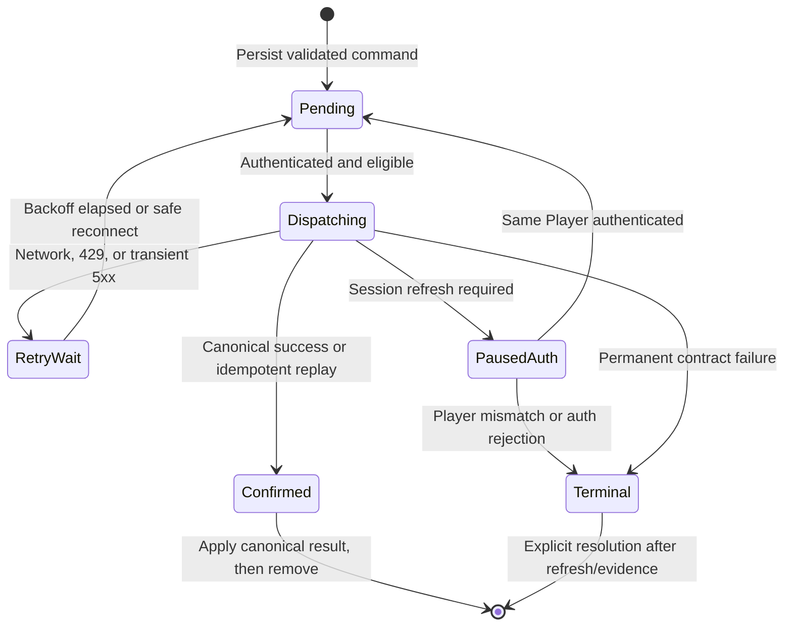

# Target Container Migration PRD

> **Role: CURRENT-SCOPED.** Snapshot of the human-approved Outcome Contract and Phase 3 delivery amendment in GitHub Issue [#592](https://github.com/JMLegere/geo-app/issues/592). This file does not expand the approved slice or authorize later phases by itself.

## Status

**APPROVED FOR THE FIRST DEPLOYABLE VERTICAL SLICE — Phase 0 architecture records, the minimum Phase 1 Local State and Sync foundation, Phase 2 Identification commit recovery, and the Phase 3 exact-SHA production release are authorized. The Phase 3 amendment automatically deploys successful push-triggered `main` CI revisions through repository YAML while retaining manual exact-SHA rollback. Additional queued commands, product features, service splits, and non-goals remain unauthorized.**

## Outcome Contract

### Desired outcome

EarthNova's implemented architecture is incrementally aligned to the approved Target Container responsibilities while preserving current player behavior and production data:

1. Player App
2. Local State and Sync
3. Identity and Game API
4. Game World Store
5. Background World Services
6. Asset Delivery

The migration keeps Flutter, Railway, and Supabase as the default implementation topology. It formalizes durable responsibility seams and closes demonstrated gaps; it does not create microservices merely to mirror diagram boxes.

### Current-to-target finding

- **Player App:** already implemented by the Flutter client; full Town, Home, and community features remain separate product slices.
- **Identity and Game API:** already implemented through Supabase Auth, PostgREST/RLS projections, and RPC commands.
- **Game World Store:** already implemented by PostgreSQL/PostGIS.
- **Background World Services:** already implemented by Edge Functions plus scheduled database processing.
- **Asset Delivery:** already implemented by Supabase Storage/public asset delivery.
- **Local State and Sync:** partially implemented. The bounded Client Working Set, background refresh, and Degraded Session exist; a general retryable client command queue/synchronization engine does not.

The final bounded-context map remains deliberately unresolved. This contract does not decide it.

### Migration plan

#### Phase 0 — target architecture decision and generated documentation

- Add a generated Target Container view beside the generated Current Container view.
- Update the System Context terminology approved in the diagram review: target player personas, Jeremy as Developer and Sole Director, and full-product EarthNova scope.
- Add an accepted ADR defining the six target responsibility boundaries, their current Flutter/Supabase mapping, and the rule that container responsibilities do not imply separate deployables.
- Keep current and target claims visibly distinct.

#### Phase 1 — behavior-preserving responsibility alignment

- Name and expose explicit application boundaries for Player App, Local State and Sync, Identity and Game API, Background World Services, and Asset Delivery using existing clean-architecture conventions.
- Keep the current bounded Client Working Set isolated by Execution Environment and Player.
- Preserve warm startup, cold readiness, Degraded Session, explicit Sign out purge, and the production p95 Interaction Response target.
- Remove direct cross-boundary coupling only where repository evidence demonstrates it; do not perform speculative rewrites.
- Keep Flutter, Railway, Supabase Auth/PostgREST/RPC, PostgreSQL/PostGIS, Edge Functions, and Supabase Storage.

#### Phase 2 — one safe synchronization vertical slice

- Before implementation, identify one existing server-authoritative command whose domain semantics are already idempotent and safe to retry.
- Add a bounded, typed, player/environment-scoped pending-command store without Drift, SQLite, code generation, or an unbounded local replica.
- Prove enqueue, restart recovery, authenticated retry, deduplication/idempotency, confirmation, terminal failure, Sign out purge, and observability.
- In a Degraded Session, queue only that explicitly approved command; all other unsafe commands remain disabled.
- Do not repurpose the server-side reserved `v3_write_queue` as if it were an on-device queue.

#### Phase 3 — production release and verification

- Merge only after CI, EAC, SuperBDD where applicable, focused tests, full Flutter tests, analyzer, generator drift check, and rendered C4 QA pass.
- Deploy the exact successful push-triggered `main` CI head SHA automatically through `deploy-prod.yml`; retain manual exact-SHA dispatch for rollback and recovery.
- Apply additive Supabase changes before the Railway app only if Phase 2 requires them.
- Validate production startup, authentication, Map and Pack readiness, Degraded Session behavior, queued-command behavior, telemetry, provider health, and asset delivery.
- Record the deployed SHA and verification timestamp.
- Roll back the app to the previous known-good SHA if validation fails; additive database changes must remain backward compatible.

### Acceptance signals

- Generated current and target C4 views are deterministic, visibly distinct, and render cleanly.
- An accepted ADR records the target responsibilities and current technology mapping without asserting an unresolved bounded-context or microservice split.
- Existing player-visible behavior and all production data remain intact.
- No auth derivation changes; existing users remain able to sign in.
- The Client Working Set remains bounded and passes corruption, size, identity, environment, retention, and purge tests.
- The selected synchronization slice is typed, bounded, retryable, idempotent, observable, and safe across restart and Sign out.
- No other gameplay command becomes available in a Degraded Session.
- `flutter analyze --no-fatal-infos`, the complete Flutter suite with the repository coverage gate, `npm run eac:check`, applicable SuperBDD scenarios, C4 generator check, and rendered diagram QA pass.
- The exact merged SHA deploys successfully to production and the post-deploy runbook checks show no regression.

### Non-goals

- Implementing unresolved Town, Home Module, social, Encounter-rate, Orb, Discipline-tuning, or other product behavior.
- Splitting Supabase responsibilities into independently deployed microservices.
- Replacing Flutter, Railway, Supabase, PostgreSQL/PostGIS, or Supabase Storage.
- General unrestricted offline gameplay or a complete local replica.
- Adding Drift, SQLite, code generation, or a second source of truth.
- Deleting or destructively rewriting legacy/production data.
- Treating the target diagram as authorization for future product features.

### Production safety

- All schema changes must be additive and backward compatible.
- No destructive migration or legacy-data deletion.
- No deployment from an unmerged or unverified commit.
- Production deployment uses the repository's serialized workflow, automatically consumes an eligible successful `main` CI head SHA, and retains manual exact-SHA recovery.
- Rollback readiness is verified before dispatch.

### Authorization evidence

Jeremy requested in ChatGPT Work on 2026-09-03: “I want you to plan and perform the migration to the target containers, and ship it to prod.”

That instruction authorizes preparation of this contract and plan. Jeremy's explicit approval of this exact GitHub Outcome Contract is still required before implementation begins.

---

## Product Requirements Document

### Document control

| Field | Value |
|---|---|
| Product | EarthNova |
| Initiative | Target Container Architecture Migration |
| Owner and approver | Jeremy Legere — Developer and Sole Director |
| Delivery owner | Codex, operating through the repository workflow |
| Status | Draft attached to the pending Outcome Contract |
| Target environment | `prod` after phased verification |
| Current production stack | Flutter 3.41.3, Riverpod 3.2.1, Railway/nginx, Supabase Auth/PostgREST/Edge Functions/PostgreSQL/PostGIS/Storage |
| Governing authority | Approved Outcome Contract → `CONTEXT.md` → accepted ADRs → current constraints |
| Last updated | 2026-09-03 |

### 1. Executive summary

EarthNova already implements most of the responsibilities shown in the approved Target Container diagram. The migration is therefore not a platform replacement and not a mandate to create six independently deployed services. It is an incremental effort to make six durable responsibilities explicit, preserve their contracts, and close the one demonstrated architectural gap: reliable local synchronization of a narrowly approved server-authoritative command.

The migration must improve inspectability, retry safety, local responsiveness, and production operability without changing current game rules, authentication derivation, production data ownership, or the player-visible meaning of existing actions. Flutter remains the Player App. Supabase remains the implementation of Identity and Game API, Game World Store, Background World Services, and Asset Delivery. Railway remains the production web host.

The first synchronization vertical slice will prefer recovery of the existing transactional `identify_v3_item` commit. That command already has exact-version validation, all-or-none writes, durable receipts, and canonical idempotent retries. It is a safer proof than delayed Cell Visit creation, because Cell Visits are server-timestamped and a never-sent offline Visit could acquire a misleading later time.

### 2. Problem statement

The current architecture is operational but its top-level responsibilities are represented unevenly:

1. The Flutter client combines the Player App, App Readiness, Client Working Set persistence, refresh coordination, and command invocation.
2. The Client Working Set provides bounded local reads and Degraded Sessions, but there is no general durable client command lifecycle.
3. Supabase responsibilities are technically separated by Auth, PostgREST/RPC, database, Edge Functions, and Storage, yet the durable target seams are not recorded as an accepted architecture decision.
4. The generated C4 set describes only current architecture, so target responsibilities can be mistaken for implemented deployables or future microservices.
5. A network failure around a safe idempotent command can still require an in-memory retry or manual player retry; restart-safe recovery is not a general client capability.
6. The final bounded-context map is unresolved. A broad refactor now could harden accidental boundaries and increase complexity without player benefit.

### 3. Product and architecture principles

- **Player meaning first:** preserve the canonical meaning of Exploration, Cell Visit, Encounter, Item, Identification, Discovery, Pack, Home, Venue, Villager, Service, and Town.
- **Humane degraded behavior:** local browsing stays responsive when an internally consistent Client Working Set exists; unsafe actions fail closed.
- **Server authority:** local state may support immediate UI and retry, but it never becomes a second source of truth.
- **Bounded local data:** all persisted client state is versioned, size-limited, environment-scoped, Player-scoped, validated on load, and purged on explicit Sign out.
- **Idempotency before retry:** no command is persisted for retry unless the server contract proves duplicate delivery is safe.
- **Vertical slices:** migrate one end-to-end behavior with tests and observability before widening the queue.
- **Technology continuity:** Flutter, Railway, and Supabase remain unless a later approved ADR explicitly replaces them.
- **No diagram-driven microservices:** a C4 container responsibility does not imply an independently deployed process.
- **Observable transitions:** every meaningful readiness, queue, dispatch, retry, confirmation, purge, and failure transition emits structured evidence.
- **Production reversibility:** deploy additive/backward-compatible changes and retain an exact-SHA application rollback.

### 4. Stakeholders and system actors

| Actor | Need |
|---|---|
| Player | Fast, trustworthy interactions; no duplicated rewards or lost committed actions; clear degraded behavior |
| Jeremy | Inspectable boundaries, deterministic diagrams, safe releases, useful telemetry, and a maintainable solo-developer operating model |
| Production operator | Exact-SHA deployment, migration ordering, health evidence, and a tested rollback path |
| Future contributor/agent | Explicit authority, stable interfaces, focused tests, and no need to infer topology from incidental code |

The target player personas remain product context, not container boundaries: Field Explorer, Cozy Cultivator, Patient Progressor, and Community Regular.

### 5. Current-to-target gap matrix

| Target responsibility | Current implementation | Gap | Required migration |
|---|---|---|---|
| Player App | Flutter web client with Map, Pack, readiness, navigation, and partial Town/Home surfaces | Target responsibility is not named consistently; full-product features are incomplete | Record the responsibility and preserve current feature boundaries; do not implement unresolved features |
| Local State and Sync | Versioned SharedPreferences Client Working Set; warm hydration; background refresh; Degraded Session | No durable, typed, restart-safe pending-command lifecycle | Extract an explicit local synchronization boundary and prove one safe command |
| Identity and Game API | Supabase Auth, PostgREST/RLS projections, security-definer RPCs | Responsibility is spread across adapters and platform terminology | Record and test the boundary; preserve auth and grants |
| Game World Store | PostgreSQL/PostGIS, immutable authored versions, exact-version player state | No target-level ADR mapping; bounded-context map remains open | Record source-of-truth and compatibility invariants without repartitioning |
| Background World Services | Edge Functions, pg_cron/pg_net processing, telemetry, enrichment, health checks | Naming and ownership are operationally scattered | Record the responsibility and verify current calls/data ownership |
| Asset Delivery | Supabase Storage and public asset URLs | Omitted from the main Supabase decomposition and weakly linked to target responsibility | Add it to generated target/current documentation and retain current delivery behavior |

### 6. Goals and measurable outcomes

#### G1 — Deterministic architecture truth

- One generator produces both current and target C4 views.
- Current views make observed implementation claims only.
- Target views make responsibility claims and label provisional implementation choices.
- A generator check fails on missing, stale, or unexpected generated files.
- Every generated Mermaid view renders without errors or material overlap.

#### G2 — Explicit responsibility seams

- Each of the six target responsibilities has an accepted definition, implementation mapping, owner, inputs, outputs, and prohibited responsibilities.
- Flutter code continues to obey domain ← data ← presentation dependency direction.
- No new deployable is created solely to match the diagram.

#### G3 — Restart-safe synchronization proof

- One approved idempotent command can be persisted before dispatch and recovered after client restart.
- Duplicate delivery cannot duplicate state, rewards, Discovery, Property Values, or receipts.
- A queue item cannot cross Execution Environment or Player identity.
- Sign out purges all queue versions for the signed-out Player/environment before session completion.
- Queue corruption, oversize payloads, unknown versions, or unknown command kinds fail closed.

#### G4 — No regression

- Existing authentication, readiness, Map, Pack, Item examination/Identification, telemetry, provider, and asset behavior remains intact.
- Interaction Response remains production p95 ≤100 ms for named primary interactions after App Readiness.
- The complete repository quality gate remains green.

#### G5 — Safe production release

- The exact merged commit is deployed through `deploy-prod.yml`.
- Production checks show successful startup, sign-in, Map/Pack readiness, synchronization recovery, telemetry, provider health, and asset delivery.
- The previous known-good application SHA is recorded before deployment and remains deployable.

### 7. Scope

#### In scope

1. Generated current and target C4 documentation.
2. Accepted ADR for target container responsibilities and implementation mapping.
3. Terminology approved during diagram review.
4. Explicit Local State and Sync application boundary.
5. A bounded local pending-command store.
6. One restart-safe, idempotent synchronization vertical slice.
7. Structured synchronization observability.
8. Focused unit, integration, behavior, architecture, generator, and rendered-diagram tests.
9. Automatic exact-CI-SHA production deployment, manual exact-SHA recovery, and post-deploy verification.

#### Out of scope

The Outcome Contract non-goals remain controlling. In particular, this PRD does not authorize new Town/Home/social gameplay, a native-app distribution program, unrestricted offline play, microservices, Supabase replacement, auth changes, destructive schema work, or deletion of legacy data.

### 8. Target responsibility requirements

#### R-ARCH — Architecture records and diagrams

- **R-ARCH-001:** Add an accepted ADR defining the six target responsibilities.
- **R-ARCH-002:** State explicitly that a target container is a software responsibility boundary, not necessarily a separate process or deployment.
- **R-ARCH-003:** Map current technologies to target responsibilities:
  - Flutter → Player App
  - SharedPreferences Client Working Set plus synchronization coordinator → Local State and Sync
  - Supabase Auth/PostgREST/RPC → Identity and Game API
  - PostgreSQL/PostGIS → Game World Store
  - Edge Functions plus scheduled processing → Background World Services
  - Supabase Storage/public delivery → Asset Delivery
- **R-ARCH-004:** Preserve the final bounded-context map as an open decision.
- **R-ARCH-005:** Generate separate Current Container and Target Container views.
- **R-ARCH-006:** Include Asset Delivery in the relevant current Supabase/container decomposition.
- **R-ARCH-007:** Apply approved System Context terminology: Player personas, Jeremy as Developer and Sole Director, and full-product EarthNova scope.
- **R-ARCH-008:** Update the C4 index and contact sheet/count for the additional target view.

#### R-APP — Player App

- **R-APP-001:** The Player App remains the Flutter runtime and composition root.
- **R-APP-002:** Screens and Notifiers must not read or mutate local pending-command storage directly.
- **R-APP-003:** Player-visible actions call an application use case; the use case decides whether to dispatch, persist for safe retry, or fail closed.
- **R-APP-004:** Existing Map, Pack, readiness, navigation, and observability behavior must remain unchanged unless this PRD explicitly says otherwise.
- **R-APP-005:** Target references to Town, Home, and community describe eventual Player App scope only; no missing behavior is invented.

#### R-LOCAL — Local State and Sync

- **R-LOCAL-001:** Introduce a Local State and Sync boundary with explicit ports for:
  - Client Working Set load/save/purge
  - pending-command enqueue/load/update/remove/purge
  - dispatch coordination
  - retry policy and error classification
- **R-LOCAL-002:** Continue using the existing approved local persistence technology. Do not add Drift, SQLite, code generation, or a second local database.
- **R-LOCAL-003:** Store the pending-command envelope separately from the Client Working Set so read snapshots and unconfirmed writes cannot corrupt one another.
- **R-LOCAL-004:** Every envelope must contain:
  - schema version
  - command identifier
  - idempotency key
  - command kind from a closed typed set
  - command-payload version
  - validated payload
  - Execution Environment
  - Player identity
  - UTC enqueue time
  - attempt count
  - next eligible attempt time
  - last classified failure, if any
  - lifecycle state
- **R-LOCAL-005:** The store must reject blank identifiers, unsupported versions, unknown kinds, malformed payloads, non-finite numbers, identity/environment mismatch, and impossible timestamps.
- **R-LOCAL-006:** No access token, refresh token, derived password, raw phone number, service key, or provider secret may be persisted.
- **R-LOCAL-007:** Initial queue bounds are:
  - maximum 100 pending commands per Player/environment
  - maximum 256 KiB encoded queue size
  - maximum individual command payload of 16 KiB
  - maximum retention of seven days unless the command contract requires a shorter lifetime
- **R-LOCAL-008:** When a bound would be exceeded, reject the enqueue, preserve the last valid queue, emit an observable failure, and show a safe actionable UI state.
- **R-LOCAL-009:** Persist a command before its first network dispatch when the selected vertical slice enters the durable path.
- **R-LOCAL-010:** Dispatch commands serially in enqueue order for the first slice. Parallel dispatch requires a later approved ordering model.
- **R-LOCAL-011:** A command in `dispatching` at process termination returns to `pending` on validated reload.
- **R-LOCAL-012:** Successful server confirmation removes the pending record only after the canonical result has been applied and the queue write succeeds.
- **R-LOCAL-013:** Explicit Sign out must purge every supported and prior stored queue version for that Player/environment. If purge fails, Sign out must stop safely, matching Client Working Set protection.
- **R-LOCAL-014:** Local and prod queues are isolated. No beta or implicit environment is supported.
- **R-LOCAL-015:** The server remains authoritative; an optimistic UI state must be visibly distinguishable from confirmed state where meaning would otherwise be ambiguous.

#### R-SYNC — Retry and dispatch policy

- **R-SYNC-001:** Only command kinds registered as server-idempotent and locally replay-safe may enter the durable queue.
- **R-SYNC-002:** Classify outcomes:
  - confirmed success → apply result and remove
  - already committed/idempotent success → apply canonical result and remove
  - network timeout/disconnect → retryable
  - HTTP 429 or transient 5xx → retryable
  - expired session → pause, refresh authentication, then retry only for the same Player
  - validation/permission/ownership/contract 4xx → terminal and fail closed
  - unknown/unclassified result → terminal by default until explicitly classified
- **R-SYNC-003:** Retry with exponential backoff and jitter, beginning at two seconds and capped at five minutes while the app is active.
- **R-SYNC-004:** A retry must reuse the same command identifier/idempotency key and exact validated payload.
- **R-SYNC-005:** Background refresh must not delay App Readiness once the Client Working Set is usable.
- **R-SYNC-006:** Degraded Session may expose only explicitly queue-safe actions; every other server-authoritative action remains disabled.
- **R-SYNC-007:** Reconnection triggers dispatch after authentication and ownership checks.
- **R-SYNC-008:** Manual Retry may accelerate an eligible pending command but cannot bypass backoff for rate limiting, terminal classification, auth mismatch, or contract failure.
- **R-SYNC-009:** A terminal item remains inspectable long enough to provide recovery evidence, then requires explicit dismissal or a confirmed server refresh; it must not retry forever.

#### R-FIRST — First synchronization vertical slice

- **R-FIRST-001:** The preferred first slice is durable recovery of the transactional `identify_v3_item` commit after a valid server-prepared Identification plan.
- **R-FIRST-002:** Before implementation, tests and SQL inspection must prove:
  - the RPC is canonically idempotent for the same Item and exact prepared identities
  - retry returns the committed aggregate/receipt rather than duplicating writes
  - stale or mismatched plans fail closed
  - Discovery, selected Property Values, visible Item state, and receipts commit atomically
  - no Discipline or unrelated side effects are introduced
- **R-FIRST-003:** The durable envelope must contain only the minimum already-validated identities and plan data required by the current RPC. It must not cache hidden Item identity before examination/prepare authorizes disclosure.
- **R-FIRST-004:** The Player's hold-to-identify intent creates one durable command identity. Every retry reuses it.
- **R-FIRST-005:** If the pre-implementation audit finds any replay ambiguity, this slice must not proceed. Record the blocker in the issue and select another already-idempotent command through an explicit contract amendment.
- **R-FIRST-006:** Cell Visit is not the default first slice. Although `record_v3_cell_visit(cell_id, client_event_id)` is idempotent, a command that was never received would be server-stamped at later synchronization time. Enabling delayed Cell Visits requires a separate decision about canonical visit time and trust.
- **R-FIRST-007:** Successful Identification synchronization refreshes or applies the canonical Pack/Discovery aggregate and commits a new internally consistent Client Working Set.
- **R-FIRST-008:** The slice must work across:
  - success on first dispatch
  - response lost after server commit
  - timeout before server receipt
  - application restart with a pending command
  - application restart with a previously dispatching command
  - session refresh for the same Player
  - wrong Player/session
  - explicit Sign out
  - malformed or obsolete queue data
  - permanent server rejection

#### R-API — Identity and Game API

- **R-API-001:** Preserve phone-derived email/password authentication byte-for-byte.
- **R-API-002:** Derive Player ownership from the authenticated session server-side; never trust a client-supplied owner.
- **R-API-003:** Keep reads behind owner-bound projections and writes behind authenticated RPC commands.
- **R-API-004:** The selected command's idempotency evidence must be enforced server-side, not inferred only by the client.
- **R-API-005:** Any SQL change must be additive, backward compatible, RLS/grant tested, and safe for the previous app version.
- **R-API-006:** Prefer the current Identification receipt/idempotency mechanism. Add a generic command-receipt table only if the audit proves the current receipt cannot return canonical retry results; such a change requires updating this issue before implementation.

#### R-DATA — Game World Store

- **R-DATA-001:** PostgreSQL/PostGIS remains the production source of truth.
- **R-DATA-002:** Exact authored versions and existing Player-bound identities must never be rewritten by the client queue.
- **R-DATA-003:** No destructive migration, legacy deletion, ownership reassignment, or broad backfill.
- **R-DATA-004:** A migration must remain forward compatible with the old client throughout deployment ordering.
- **R-DATA-005:** Existing immutable Identification, Discovery, Cell Visit, Encounter, and Outcome invariants remain controlling.

#### R-WORLD — Background World Services

- **R-WORLD-001:** Edge Functions and scheduled database processing remain the current implementation.
- **R-WORLD-002:** Synchronization dispatch is a Player App responsibility while the app is active; this PRD does not require a new always-on client background service.
- **R-WORLD-003:** Existing telemetry, enrichment, processing, health, cleanup, and notification jobs must continue unchanged.
- **R-WORLD-004:** A future independently deployed worker requires a separate approved ADR and Outcome Contract.

#### R-ASSET — Asset Delivery

- **R-ASSET-001:** Supabase Storage/public asset URLs remain the current Asset Delivery implementation.
- **R-ASSET-002:** No generated art or existing object is rewritten as part of the migration.
- **R-ASSET-003:** Client loading, caching, missing-frame behavior, and public URL contracts remain unchanged.
- **R-ASSET-004:** Production verification must load representative static and generated species art.

### 9. Pending-command lifecycle

Lifecycle invariants:

- There is never more than one active dispatcher for the same Player/environment.
- Queue mutation is serialized.
- A process crash cannot convert an unconfirmed command into confirmed state.
- A response-loss retry returns canonical server state.
- Unknown state values invalidate the stored queue rather than being guessed.
- Terminal state never mutates authoritative Player data locally.

### 10. Player experience requirements

- Normal successful Identification should feel unchanged.
- Queue persistence and dispatch must not add a blocking step before the first meaningful local response.
- When a retry is occurring in an otherwise usable session, use a compact non-blocking synchronization status.
- In a Degraded Session, do not imply server confirmation.
- A permanent failure must use plain language and provide Retry only when retry is safe; technical details go to telemetry.
- Do not expose Supabase names, HTTP codes, stack traces, queue internals, or idempotency keys to the Player.
- Accessibility, keyboard focus, 200% text, reduced motion, and existing touch-target requirements continue to apply.

### 11. Observability requirements

Every event uses the existing app session/trace conventions, omits secrets and raw phone numbers, and includes environment plus a non-sensitive command kind. Player identity follows existing privacy rules.

Required events:

| Event | Required meaning |
|---|---|
| `sync.queue.load_started` / `completed` / `failed` | Queue hydration outcome |
| `sync.command.enqueued` | Durable write succeeded |
| `sync.command.enqueue_rejected` | Validation or bound failure |
| `sync.command.dispatch_started` | Network attempt begins |
| `sync.command.confirmed` | Canonical result applied |
| `sync.command.retry_scheduled` | Retryable failure and next delay |
| `sync.command.auth_paused` | Waiting for same-Player session recovery |
| `sync.command.terminal` | Permanent failure |
| `sync.queue.purged` / `purge_failed` | Sign out data protection |
| `sync.queue.corrupt_removed` | Invalid persisted state failed closed |
| `sync.queue.bound_exceeded` | Count/size/retention protection |
| `sync.recovery.completed` | Restart or response-loss recovery succeeded |

Metrics/checks:

- pending count by command kind and environment
- oldest pending age
- retry count distribution
- confirmation latency
- terminal failure rate
- purge failures
- queue corruption count
- duplicate-delivery/idempotent-replay count
- App Readiness and Interaction Response regression comparison

No payload containing hidden identity, selected Property Values, secrets, or raw personal information is logged.

### 12. Security and privacy requirements

- Authenticate every dispatch.
- Revalidate ownership, exact versions, examination/prepare state, and command payload server-side.
- Never trust a locally persisted Player ID as authorization.
- Reject queue loading after Player/environment mismatch.
- Purge on explicit Sign out before completing the sign-out transition.
- Do not include auth tokens or credential derivation material in local records.
- Maintain current RLS and function grant restrictions.
- Treat local storage as tamperable input and validate every field.
- Fail closed on clock anomalies, unsupported versions, or unknown commands.
- Preserve disclosure boundaries: queued Identification cannot reveal hidden identity earlier than the current service flow.

### 13. Performance and reliability requirements

- Named primary Interaction Response remains p95 ≤100 ms after App Readiness.
- Queue load participates in App Readiness only to the minimum necessary to prevent unsafe duplicate dispatch; full synchronization does not block usability.
- Queue decoding and validation must remain bounded by the size limits.
- No retry loop may busy-spin or use unbounded memory.
- Backoff timers stop on Sign out, disposal, Player change, or terminal failure.
- One corrupted record must not cause indefinite loading.
- A failed replacement write preserves the last valid persisted queue.
- App restart recovery is deterministic and covered by tests.

### 14. Delivery phases and exit criteria

#### Phase 0 — architecture and documentation

Deliverables:

- generator changes
- revised System Context and Current Container terminology
- new Target Container view
- revised Supabase view including Asset Delivery
- updated C4 README/contact sheet
- accepted target-container ADR
- generator and render tests

Exit criteria:

- generator check passes twice with byte-identical output
- every diagram renders and is visually reviewed
- ADR does not close the bounded-context question
- no runtime behavior changes

#### Phase 1 — Local State and Sync boundary

Deliverables:

- domain-safe queue types
- persistence port and SharedPreferences adapter
- dispatch coordinator boundary
- error classification and retry policy
- composition-root wiring
- observability events
- unit and architecture tests

Exit criteria:

- no command kind is enabled yet unless all Phase 1 tests pass
- bounds, validation, corruption, restart, identity/environment isolation, and purge behavior proven
- current readiness tests remain green

#### Phase 2 — Identification synchronization slice

Deliverables:

- replay/idempotency audit
- typed Identification command envelope
- durable enqueue before dispatch
- restart/reconnection recovery
- canonical result application
- Player status/error treatment
- focused Flutter, SQL-contract, and behavior tests

Exit criteria:

- all R-FIRST scenarios pass
- duplicate delivery produces one committed result
- stale/mismatched preparation fails closed
- no other command is queue-enabled
- full quality gates pass

#### Phase 3 — release

Deliverables:

- reviewed PR and merge SHA
- pre-deploy backup/rollback evidence
- automatic guarded workflow dispatch for the successful push-triggered `main` CI head SHA
- retained manual exact-SHA rollback/recovery dispatch
- workflow/job verification
- production smoke and telemetry record
- issue comment with deployed SHA, time, checks, and anomalies

Exit criteria:

- Supabase step succeeds if changes exist
- Railway deployment reaches healthy state
- production sign-in, readiness, Map, Pack, Identification recovery, telemetry, providers, and assets pass
- no material error spike
- rollback not required, or rollback completed and incident recorded

### 15. Test strategy

#### Unit tests

- envelope construction and validation
- supported-version and command-kind parsing
- size/count/retention limits
- retry classification
- backoff cap and jitter bounds
- queue state transitions
- identity/environment matching
- serialization round trips
- corruption and unknown-field behavior
- Sign out purge across stored versions

#### Adapter tests

- SharedPreferences write/read/update/remove
- failed replacement preserves prior valid data
- dispatcher reuses exact idempotency identity
- auth pause and same-Player resume
- wrong-Player rejection
- canonical result application before removal

#### Identification integration tests

- first success
- response lost after commit then idempotent retry
- timeout before receipt
- restart from pending
- restart from dispatching
- permanent stale-plan failure
- atomic Discovery/Property/Item/receipt result
- no double rewards or side effects

#### Existing regression gates

- complete Flutter suite with ≥95% covered-line gate under current exclusions
- `flutter analyze --no-fatal-infos`
- `npm run eac:check`
- applicable `npm run superbdd:cucumber`
- C4 generator `--check`
- Mermaid rendering
- `git diff --check`

#### Production validation

- cold and warm sign-in
- session persistence/refresh
- Map steady state and movement
- Pack load and Item inspection
- controlled Identification recovery scenario
- Degraded Session safety
- sign-out purge evidence
- asset loads
- provider health
- required telemetry events
- no unexpected screen-boundary or responsiveness regression

### 16. Rollout and rollback

#### Rollout

1. Record current production app SHA and latest successful workflow.
2. Confirm required GitHub secrets without exposing values.
3. Confirm additive migration compatibility if database work exists.
4. Merge only after all required checks pass.
5. Let the successful push-triggered `main` CI completion invoke `deploy-prod.yml` with its exact `head_sha`.
6. Supabase deploy completes before Railway application deploy.
7. Wait for Railway health and then execute the runbook validation.
8. Record evidence in Issue #592.

#### Rollback triggers

- authentication regression
- inability to reach App Readiness
- queue corruption or cross-Player leakage
- duplicated Identification/Discovery/Property writes
- terminal retry storm or rate-limit amplification
- Interaction Response regression beyond the approved target
- material telemetry or provider-health regression
- asset delivery failure caused by the release

#### Rollback action

- Redeploy the previous known-good application SHA through the same manual workflow.
- Do not reverse additive database changes unless a separately reviewed down-migration is proven safe.
- Disable the new command registration through code/config rollback; old clients must remain compatible.
- Preserve queue/telemetry evidence for diagnosis without exposing Player data.
- Record the incident and next authorization required.

### 17. Risks and mitigations

| Risk | Mitigation |
|---|---|
| Target boxes interpreted as mandatory microservices | ADR explicitly separates responsibility from deployment |
| Local queue becomes a second source of truth | Store commands, not authoritative aggregates; apply canonical server results |
| Duplicate gameplay mutations | Server-enforced idempotency and response-loss tests |
| Queue crosses Player/environment | Envelope validation, namespaced keys, auth checks, purge |
| Hidden Item information leaks locally | Persist only post-prepare authorized data; validate disclosure tests |
| Infinite retry/rate-limit storm | Closed classification, bounded backoff, terminal default |
| SharedPreferences grows without bound | Count, total-byte, item-byte, and retention limits |
| Delayed actions change domain meaning | Enable only explicitly audited command kinds; defer Cell Visit |
| Big-bang refactor destabilizes prod | Phased vertical slices and behavior-preserving boundaries |
| Diagram diverges from implementation | Single generator plus drift check |
| Production deploy applies unreviewed SHA | Guard the `workflow_run` source to successful push-triggered `main` CI and deploy its exact `head_sha`; retain explicit exact-SHA recovery |
| Solo operator cannot diagnose failure | Required telemetry, deploy record, and rollback checklist |

### 18. Dependencies and sequencing

- Outcome Contract approval is required before implementation.
- The target-container ADR and generated diagrams precede runtime refactoring.
- Local queue infrastructure precedes command registration.
- Identification replay audit precedes durable Identification enqueue.
- Full CI and architecture checks precede merge.
- Merge and exact SHA verification precede production deployment.
- Town, Home, community, additional command kinds, native distribution, and service decomposition require separate approved work.

### 19. Definition of done

This initiative is done only when:

- Issue #592's Outcome Contract is approved.
- All Phase 0–3 deliverables and exit criteria are satisfied.
- Current and target C4 views are committed and deterministic.
- The target-container ADR is accepted.
- The Local State and Sync boundary is explicit and tested.
- One Identification commit can recover safely across restart and response loss.
- No other command is accidentally queue-enabled.
- All repository gates pass.
- The reviewed merge SHA is deployed to production.
- Production validation passes and is recorded.
- The previous known-good SHA and rollback evidence are recorded.
- Issue #592 is updated with the PR, merge, workflow, production SHA, verification timestamp, and final outcome.

### 20. Approval

Approval of Issue #592 authorizes the phased implementation and exact-SHA production release described above. It does not authorize any non-goal, destructive database action, additional queued command, new product feature, microservice split, or technology replacement.

